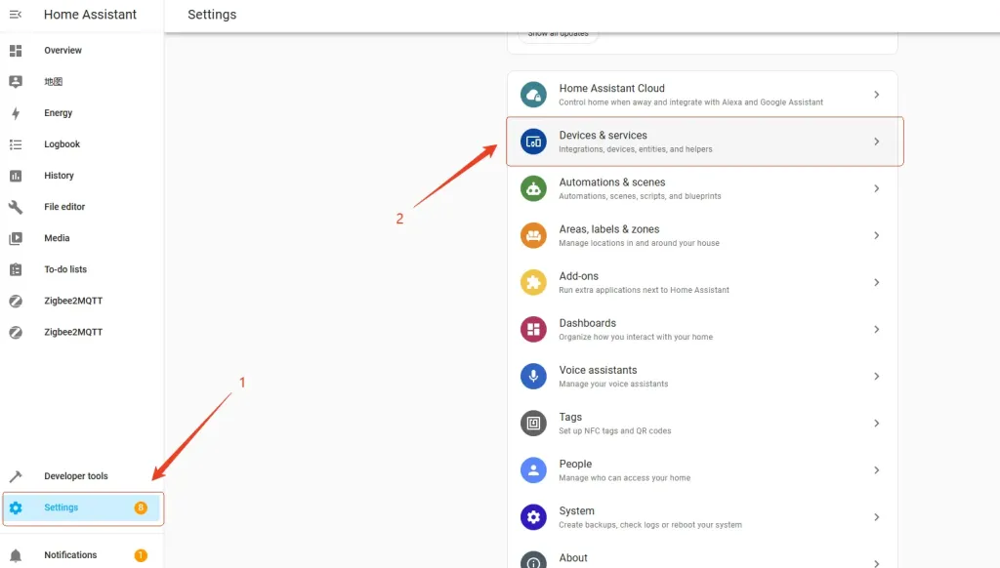
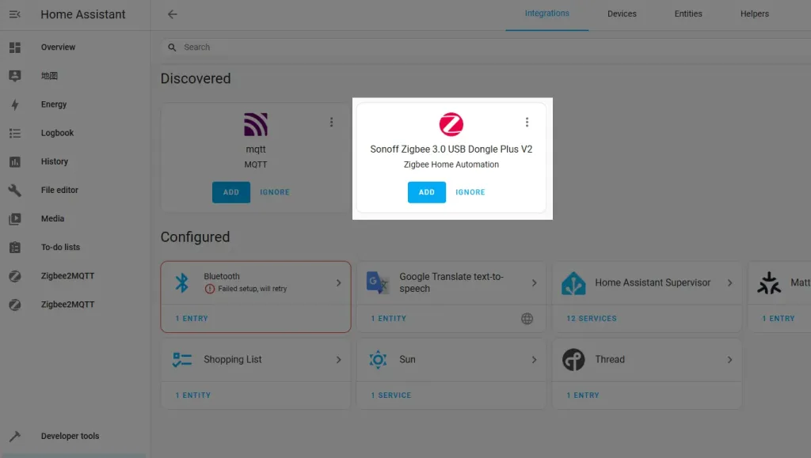
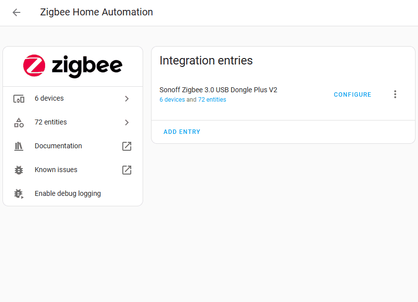

# Connecting to Home Assistant via ZHA

This guide is based on Home Assistant. For more details, please visit: [Home Assistant – ZHA](https://www.home-assistant.io/integrations/zha/)

## Preparation

Before getting started, ensure that Home Assistant is installed and the ZBDongle is connected to the host’s USB port. If not yet installed, please follow the [Home Assistant Installation Guide](https://www.home-assistant.io/installation/).

## Step 1: Add Integration

In most cases, once the device is connected to the operating system, it will be automatically discovered by Home Assistant. Go to [Settings > Devices & Services](https://my.home-assistant.io/redirect/integrations/), and click “ADD” to start the configuration.

### Auto Discovery Name

| Model | Name | Note |
| :--- | :--- | :--- |
| ZBM-MG21 | Besisglas Zigbee 3.0 USB Dongle | / |

## Step 2: Configure the ZBDongle

After clicking the “ADD” button, follow the prompts to configure the ZBDongle. You will need to select a network initialization method:

1.  **Restore from previous network backup**: Used when replacing the Zigbee coordinator. Restores based on the last available network backup.
2.  **Keep existing network settings**: Used when the Zigbee coordinator remains the same and ZHA integration is re-added. Generally not recommended.
3.  **Manually upload network backup**: Used when manually migrating network data during HA migration.
4.  **Erase and create a new network**: Used to create a new Zigbee network by erasing existing network data.

### Quick Configuration Demo

## Step 3: Add a Zigbee Sub-device

Put the Zigbee sub-device into pairing mode. Then go to the **ZHA Integration > Devices** page, click “Add Device“, and the integration will begin scanning and automatically adding the Zigbee sub-device.

> **Note**: The name will vary depending on the product added.

## Troubleshooting

If the device is not automatically discovered due to special circumstances, you can manually add the ZHA integration:
**Settings → Devices & Services** → **Add Integration** → Search for **ZHA** → **Manually select device path** → **Submit**

