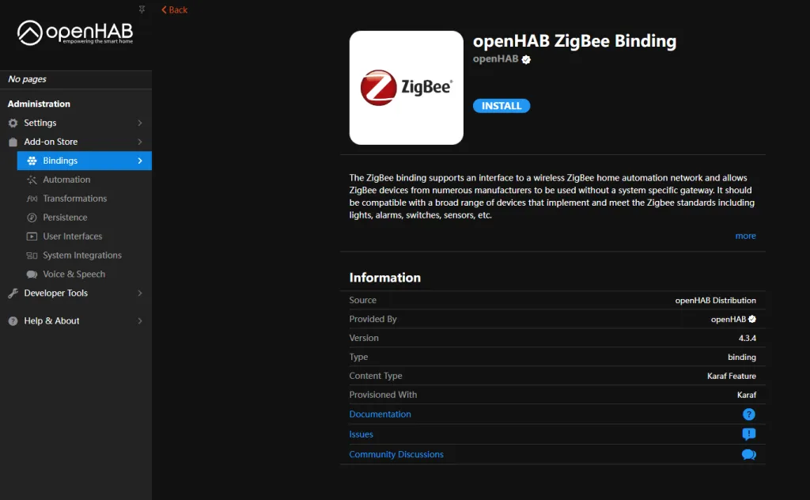
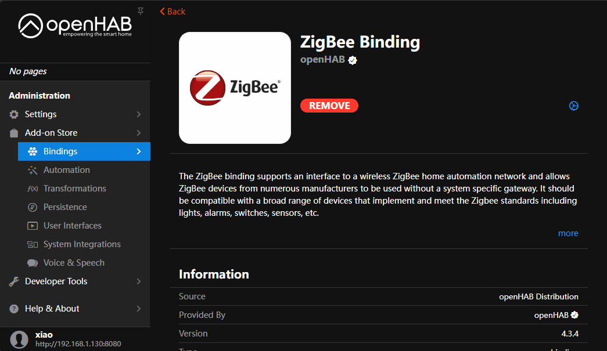
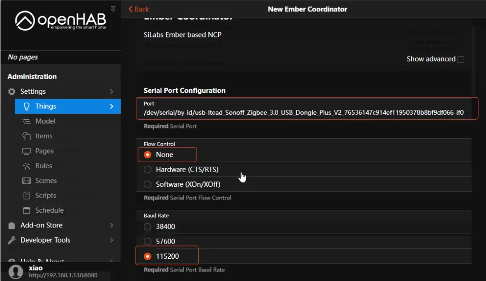
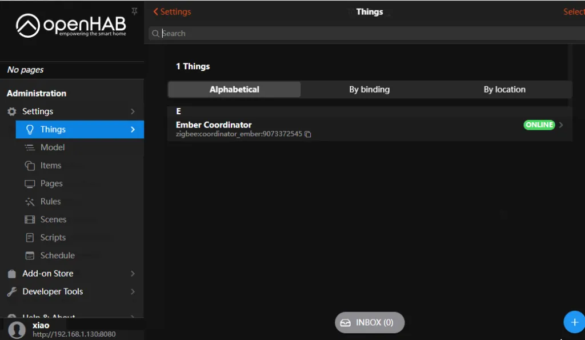
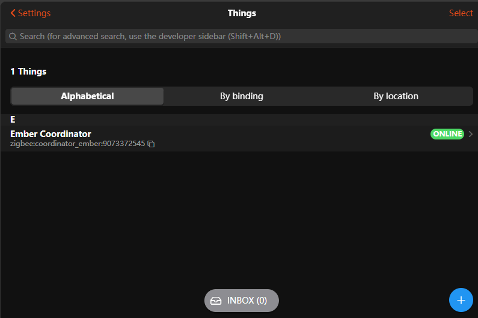

# Connecting to OpenHab

This guide is based on OpenHab. For more details, please visit [OpenHab – Zigbee Bindings](https://www.openhab.org/addons/bindings/zigbee/#zigbee-binding).

> **Note:** ZBDongle-P (TI CC2652P Chip) is currently not supported. For detailed progress, please refer to [GitHub](https://github.com/openhab/org.openhab.binding.zigbee/issues/605).

## Preparation

Before getting started, ensure that OpenHab is installed and that the ZBDongle is connected to the host’s USB port.

If OpenHab has not been installed yet, please refer to the [OpenHab installation guide](https://www.openhab.org/docs/installation/) for setup instructions.

## Step 1: Install Zigbee Binding

Go to the **Add-on Store**, search for **Zigbee**, and install the **openHAB ZigBee Binding**.

## Step 2: Add Things

Go to the **Things** page, click the “Add” icon, and select **Ember Coordinator**. Then configure the following parameters:

- **Port**: Select the `usb-Itead-Zigbee-3.0-USB-Dongle` device
- **Flow Control**: Select `None`

Keep other settings as default. After configuration, click “Create Things“. Once the Thing’s status turns green (ONLINE), the setup is complete.

**Add Things Demo:**

**Configuration:**

## Step 3: Add a Zigbee Sub-device

Put your Zigbee device into pairing mode. Then, click the “Add” button at the bottom right of the **Things** page, select **Zigbee Binding**, and click “SCAN” to start scanning and adding Zigbee devices.

Once added, the device can be configured as a Switch and controlled.
