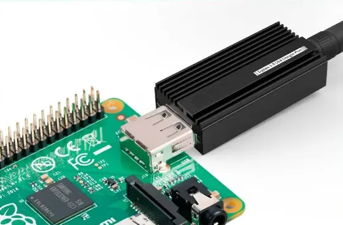
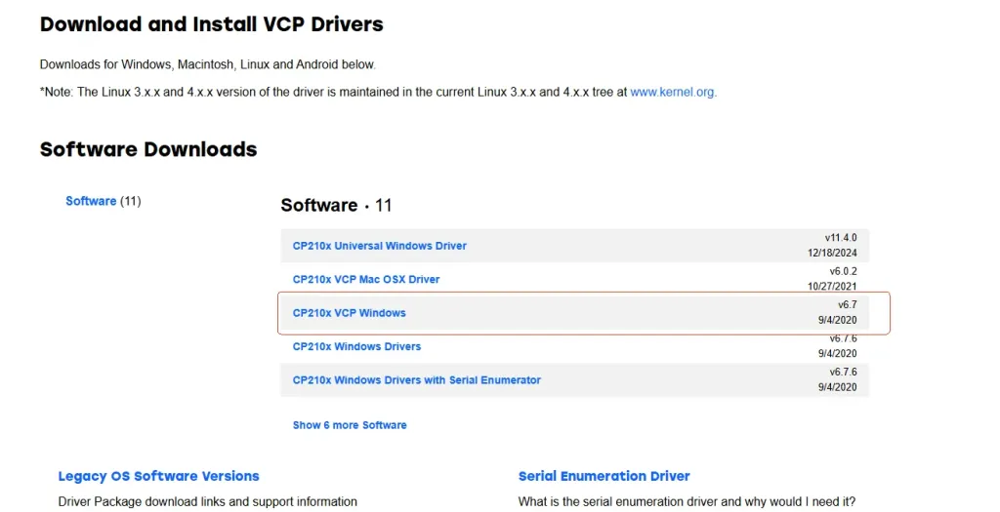
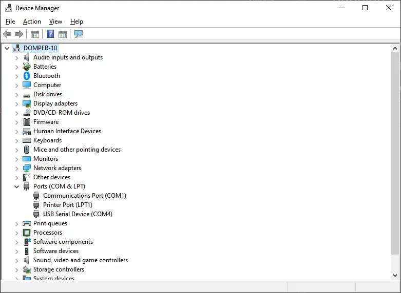
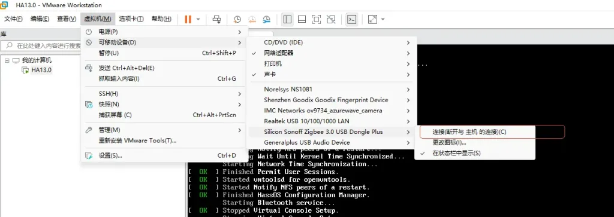
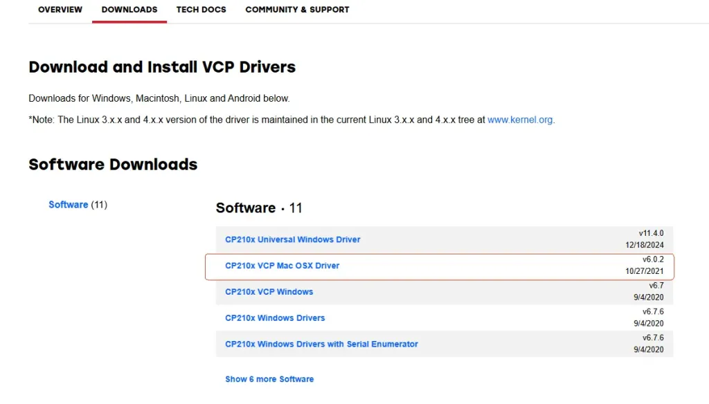

# Connecting to Operating System

Please connect the device to the USB port of the host, and install the appropriate driver according to the host operating system.

* [Connecting to Windows](#section1)

* [Connecting to Linux](#section2)

* [Connecting to Virtual Machine](#section3)

* [Connecting to macOS](#section4)

* [Connecting to Raspberry Pi OS](#section5)

<a id="section1"></a>
## Connecting to Windows

### Step 1: Install Driver

Install the CP210x Driver:
- [CP210x_VCP_Windows](./driver/CP210x_VCP_Windows.zip)

Or you can download and install the driver via the official Silicon Labs website:
- [Silicon Labs CP210x Driver Download](https://www.silabs.com/developer-tools/usb-to-uart-bridge-vcp-drivers?tab=downloads)

### Step 2: Confirm that the device is recognised

After the driver is successfully installed, open **Device Manager** and expand **Ports (COM & LPT)**. The corresponding USB device will be recognized.



As shown above, the serial port for the device is: `COM4`

<a id="section2"></a>
## Connecting to Linux

Most recent versions of Ubuntu or other Linux distributions already include the CP210x driver by default, so no additional installation is required.

After connecting the ZBDongle device, you can check if it was recognized by entering the following command in the terminal:

```bash
sudo dmesg
```

Output example:
```
[  534.739948] cp210x 3-8:1.0: cp210x converter detected
[  534.741643] usb 3-8: cp210x converter now attached to ttyUSB0
```

### Checking the Serial Port Path

To obtain the serial port path of the connected device, use the following command:

```bash
ls -l /dev/serial/by-id
```

Example output:



The corresponding serial port path is: `/dev/ttyUSB0`

<a id="section3"></a>
## Connecting to Virtual Machine

If Home Assistant is running on a virtual machine, in addition to installing the appropriate driver for the operating system, make sure to connect the device to the virtual machine. VMware is used as an example here.



<a id="section4"></a>
## Connecting to macOS

### Step 1: Install Driver

Install the CP210x driver:
- [Mac_OSX_VCP_Driver](./driver/Mac_OSX_VCP_Driver.zip)
- Or download from: [Silicon Labs CP210x Driver Download](https://www.silabs.com/developer-tools/usb-to-uart-bridge-vcp-drivers?tab=downloads)

### Step 2: Confirm that the device is recognised

After successful installation, run the following command in Terminal:

```bash
ls /dev/tty.*
```

If recognized, the information will return after Enter:



The serial port is: `/dev/tty.usbserial-14220`

<a id="section5"></a>
## Connecting to Raspberry Pi OS

Most Raspberry Pi OS typically includes the CP210x driver by default. No installation is required.

After connecting the ZBDongle device, you can check if it was recognized by entering the following command in the terminal:

```bash
sudo dmesg
```

### Checking the Serial Port Path

To obtain the serial port path of the connected device, use the following command:

```bash
ls -l /dev/serial/by-id
```

Example output:



The corresponding serial port path is: `/dev/ttyUSB0`
