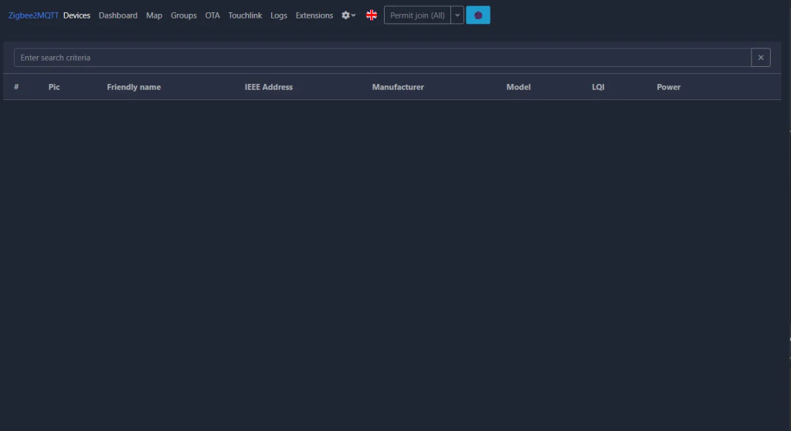
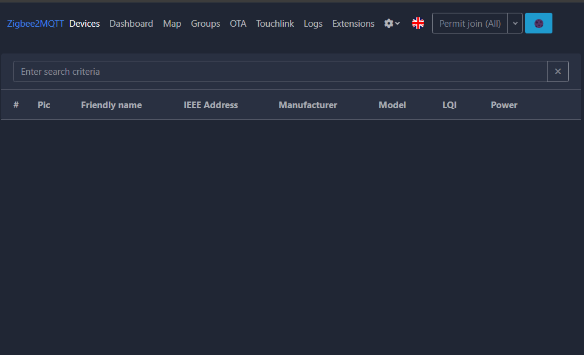

# Connecting to Zigbee2MQTT

This guide follows the official Zigbee documentation. For more operations, please visit [Zigbee2MQTT](https://www.zigbee2mqtt.io/).

## Preparation

Before getting started, ensure that Zigbee2MQTT is installed and that the ZBDongle is connected to the host’s USB port.

If Zigbee2MQTT and Mosquitto MQTT Broker have not been installed yet, please refer to the [Zigbee2MQTT Installation Guide](https://www.zigbee2mqtt.io/guide/installation/) and the [Mosquitto Installation Guide](https://randomnerdtutorials.com/how-to-install-mosquitto-broker-on-raspberry-pi/).

## Step 1: Start Zigbee2MQTT

It is recommended that Zigbee2MQTT be updated to version 2.2.0, which supports automatic discovery and configuration of ZBDongle-E. Run the following commands to start Zigbee2MQTT:

```bash
cd /opt/zigbee2mqtt
sudo pnpm start
```

If started successfully, you will see output similar to the following, indicating that Zigbee2MQTT has been launched correctly:

```log
[2025-04-02 09:44:12] info:     z2m: Logging to console, file (filename: log.log)
[2025-04-02 09:44:12] info:     z2m: Starting Zigbee2MQTT version 2.2.0 (commit #c5c07e7d)
[2025-04-02 09:44:12] info:     z2m: Starting zigbee-herdsman (3.4.11)
[2025-04-02 09:44:12] info:     zh:adapter:discovery: Matched adapter: {"path":"/dev/ttyUSB0","manufacturer":"Itead","serialNumber":"76536147c914ef11950378b8bf9df066","pnpId":"usb-Itead_Sonoff_Zigbee_3.0_USB_Dongle_Plus_V2_76536147c914ef11950378b8bf9df066-if00-port0","vendorId":"10c4","productId":"ea60"} => ember: path=/dev/ttyUSB0, score=4
[2025-04-02 09:44:15] info:     z2m: zigbee-herdsman started (restored)
[2025-04-02 09:44:15] info:     z2m: Coordinator firmware version: '{"meta":{"build":0,"ezsp":13,"major":7,"minor":4,"patch":4,"revision":"7.4.4 [GA]","special":0,"type":170},"type":"EmberZNet"}'
[2025-04-02 09:44:15] info:     z2m: 0x00124b00258a5e02 (0x00124b00258a5e02): S26R2ZB - SONOFF Zigbee smart plug (Router)
[2025-04-02 09:44:15] info:     z2m: Currently 1 devices are joined.
[2025-04-02 09:44:15] info:     z2m: Connecting to MQTT server at mqtt://localhost
[2025-04-02 09:44:15] info:     z2m: Connected to MQTT server
[2025-04-02 09:44:15] info:     z2m:mqtt: MQTT publish: topic 'zigbee2mqtt/bridge/state', payload '{"state":"online"}'
[2025-04-02 09:44:15] info:     z2m: Started frontend on port 8081
[2025-04-02 09:44:15] info:     z2m:mqtt: MQTT publish: topic 'zigbee2mqtt/0x00124b00258a5e02', payload '{"state":"OFF"}'
[2025-04-02 09:44:15] info:     z2m: Zigbee2MQTT started!
```

### (Optional) Manually Configure Zigbee2MQTT

> **Note:** This section is only required if:
> - Your Zigbee2MQTT version is below 2.2.0, or
> - You encounter errors when starting Zigbee2MQTT.

Normally, running Zigbee2MQTT will automatically detect and configure the dongle without manual intervention.

To manually configure, modify the `configuration.yaml` file. Example steps on Linux:

```bash
cp /opt/zigbee2mqtt/data/configuration.example.yaml /opt/zigbee2mqtt/data/configuration.yaml
nano /opt/zigbee2mqtt/data/configuration.yaml
```

The first command backs up the original configuration file. The second command opens `configuration.yaml` for editing. Modify the following sections:

```yaml
# MQTT settings
mqtt:
    base_topic: zigbee2mqtt
    server: 'mqtt://localhost'
    
frontend:   
    enabled: true           //Enable frontend
# adapter settings
serial:
    port: /dev/ttyUSB0    //Replace with the serial port path obtained in Step 1
    adapter: ember       
//For the ZBDongle-P, the adapter is zstack. 
//For the ZBDongle-E, the firmware version below 7.4 uses ezsp, while firmware version 7.4 and above uses ember.
```

After editing, press “CTRL + O” to save and “CTRL + X” to exit.

Then, restart Zigbee2MQTT:

```bash
cd /opt/zigbee2mqtt
sudo pnpm start
```

## Step 2: Access the Frontend Console

You can access the Zigbee2MQTT frontend via: `http://localhost:8081`



## Step 3: Add a Zigbee Sub-device

Put your Zigbee device into pairing mode, then click “Permit join (All)” in the Zigbee2MQTT frontend. The device will be scanned and added automatically.

The Zigbee2MQTT Supported Devices List: [Zigbee2MQTT Support device](https://www.zigbee2mqtt.io/supported-devices/)


