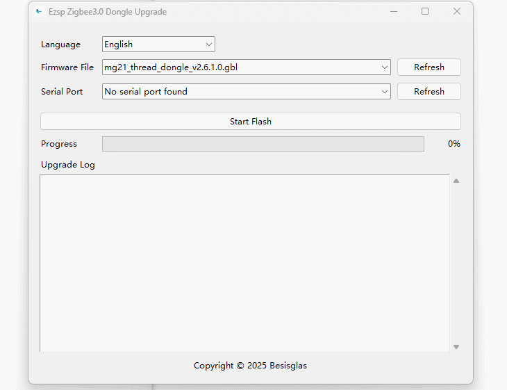

Besisglas Zigbee 3.0 USB Dongle (ZBM-MG21) Product Introduction

* [Product Introduction](#section1)

* [Appearance Display](#section2)

* [Hardware Specification](#section3)

* [Compatible Open-Source Platforms](#section4)

* [Getting Started](#section5)

* [How to Flash Firmware](#section6)

* [Learn More](#section7)

* [FAQ](#section8)
* [BUY](#section9)

## Product Introduction

Besisglas Zigbee 3.0 USB Dongle is a universal Zigbee USB coordinator, model “ZBM-MG21”. It can be used as a Zigbee gateway in Home Assistant, openHAB, Zigbee2MQTT, or other open-source platforms to control all your Zigbee devices locally.
Additionally, it supports easy firmware flashing using the official Dongle Upgrade Tool, allowing it to function as a Zigbee router for network extension, a Thread coordinator with OpenThread RCP firmware.

## Appearance Display

## Hardware Specification

| Name                     | Description                                         |
|--------------------------|-----------------------------------------------------|
| Zigbee SoC               | EFR32MG21 ARM® Cortex®-M33                          |
| USB-Serial Chip          | CP2102(N)                                           |
| Input                    | DC 5V ⎓ 500mA                                       |
| Signal range             | 135 m in free line of sight                         |
| Signal Strength          | Max 20 dB + antenna gain 2 dB                       |
| RF Frequency             | 2.4 GHz                                             |
| RF Standard              | IEEE 802.15.4 / Zigbee 3.0 / Thread                 |
| Working Temperature      | -20 °C to 60 °C                                     |
| Working Humidity         | 5%-95%RH                                            |
| Supported OS             | Windows, Ubuntu, Raspberry Pi OS / Raspbian, Docker |
| Dimensions               | 60 mm × 19 mm × 10 mm                               |

## Compatible Open-Source Platforms

| Open-Source Platform | Supported |
|----------------------|-----------|
| Home Assistant       | ✅        |
| Zigbee2MQTT          | ✅        |
| OpenHab              | ✅        |

## Getting Started

### Step 1: Connecting to the Operating System

| Operating System | Plug & Play | Guide Link |
| :--------------: | :---------: | :--------: |
| Windows | No. Driver installation required | [ZBM-MG21](./Connecting%20to%20Operating%20System.md) |
| Linux/Ubuntu | Yes | / |
| Raspberry Pi OS | Yes | / |
| Mac OS | No. Driver installation required | [ZBM-MG21](./Connecting%20to%20Operating%20System.md) |
| Virtual Machine | It depends on the host where the virtual machine is deployed | [ZBM-MG21](./Connecting%20to%20Operating%20System.md) |
### Step 2: Connecting to Open-source Platforms 

| Open-source Platforms | Guide Link |
| :-------------------: | :--------: |
| Home Assistant | [ZBM-MG21](./Connecting%20to%20Home%20Assistant%20via%20ZHA.md) |
| Zigbee2MQTT | [ZBM-MG21](./Connecting%20to%20Zigbee2MQTT.md) |
| OpenHab | [ZBM-MG21](./Connecting%20to%20OpenHab.md) |

## How to Flash Firmware

### Step 1: Download the Required Software
- [Windows Platform]()
- [macOS Platform]()
- [Linux Platform]()

### Step 2: Flash the Firmware

- Open the Dongle Upgrade Tool.
- Select the appropriate firmware file.
- Select the USB Serial Port.
- Click “Start Flash” to upgrade the firmware.

## Learn More

## FAQ

### How to put the device with router firmware into the pairing mode?
Just press and hold the **Boot** button for more than 8 seconds and then release it. When you see the green light flashing, you will enter the pairing mode.

### Devices supported by Besisglas Zigbee Dongle
Besisglas Zigbee Dongle works great with most Zigbee devices, including popular brands like Aqara, Philips Hue, IKEA, Tuya, Sonoff, and many more, mainly depends on the home automation platform on which the user uses dongle:
*   ZHA: [https://www.home-assistant.io/integrations/zha](https://www.home-assistant.io/integrations/zha)
*   Zigbee2MQTT: [https://www.zigbee2mqtt.io/guide/supported-hardware.html](https://www.zigbee2mqtt.io/guide/supported-hardware.html)
*   Openhab: [https://www.openhab.org/addons/bindings/deconz/](https://www.openhab.org/addons/bindings/deconz/)

In addition to check the supported devices through the official platform, you also can view [Blakadder compatibility lists](https://zigbee.blakadder.com/zha.html) which provides an extensive overview of the devices supported by different platforms.

### How many devices can Besisglas Zigbee 3.0 USB dongle support
The ZBM-MG21 supports up to 32 Zigbee devices in coordinator mode and 96 Zigbee devices in router mode.

32 children Zigbee devices can be directly added to the ZBM-MG21 in coordinator mode and extra 96 zigbee devices with a router, no limit on firmware but depends on platforms.

### Can I run 2 Dongles with ZHA and Zigbee2MQTT on the same machine together
Yeah, you can run two dongles at the same time. One in ZHA, the other one in Zigbee2MQTT, as long as you can uniquely identify them on the USB ports and keep separate Zigbee channels, ZHA defaults to 15, Zigbee2MQTT defaults to 11.

### Can I run Zigbee2MQTT and ZHA together on the same Dongle?
No. Zigbee2MQTT and ZHA are the same protocol (Zigbee). You can run one or the other, or buy a second dongle and run both on separate dongles.

### Can I run 2 Dongles with ZHA simultaneously
No, Users can only add one ZHA integration to Home Assistant (but HA can connect to multiple deCONZ or Zigbee2MQTT instances).

### How to flash Zigbee dongle as Router?
Besisglas Zigbee dongle is pre-installed with coordinator firmware, which can only be used to add sub-devices and cannot be added by other gateways (the Zigbee protocol stipulates that there can only be one gateway in each Zigbee network).

If you need to expand the Zigbee signal range, you can flash the router firmware read the [How to Flash Firmware](#section6).

### Do I need a USB extension cable
It's highly recommended using a USB extension cable between your USB port and your Zigbee dongle to minimise interferences.

## BUY

[BUY ON AMAZON](https://www.amazon.com/dp/B0G24L33V5)